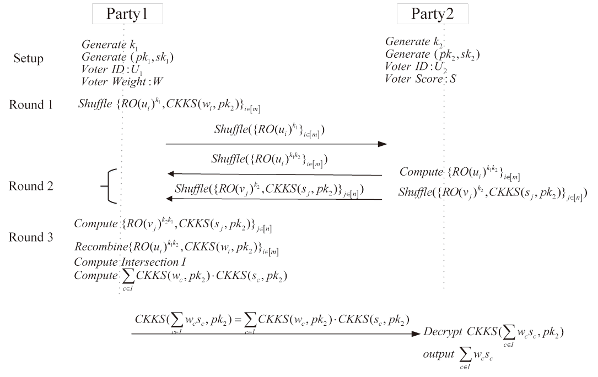

# PIWS


This project is the supporting material of the paper "**PIWS: Private Intersection Weighted Sum Protocol for Privacy-Preserving Score-Based Voting with Perfect Ballot Secrecy**", including: source code, formal analysis files, etc.

<u>PIWS</u> is a scalable, fair, and privacy-preserving intersection weighted sum protocol that privately computes the intersection of identity index sets maintained by each participant, and privately calculates the weighted sum of the data associated with the identity indexes of the intersection set.

## Folder introduction

### Formal analysis
The folder "Formal analysis" contains files used for formal analysis.

### Sourse code
The folder "Sourse code" includes the source code of <u>PIWS</u> and its installation and usage tutorials. 

## How to install and use

PIWS requires c/c++.

### Using Git

```bash
git clone https://github.com/PIWSProtocol/PIWS.git && cd Sourse_code
```

### Client

The client installation process of PIWS is as follows.

```bash
cd jj-client-server
bazel build :all
```

### Server

The server installation process of PIWS is as follows.

```bash
cd jj-client-server
bazel build :all
```

### SEAL-server

The installation process of SEAL-server is as follows.

```bash
sudo apt-get install clang
sudo apt-get install cmake
sudo apt-get install gcc
sudo apt-get install g++
cd SEAL-server
cmake -S . -B build -D SEAL_BUILD_SERVERADD=ON 
cmake --build build
cd native/server-add
cmake -S . -B build
cmake --build build
```

The code to run the server-add is as follows.

```bash
./build/bin/serveradd
```

### SEAL-main

The installation process of SEAL-main is as follows.

```bash
cd SEAL-main
cmake -S . -B build -D SEAL_BUILD_WEBSERVERENCRYPT=ON,SEAL_BUILD_WEBSERVERDECRYPT=ON
cmake --build build
sudo cmake --install build
cd native/webserver-decrypt
cmake -S . -B build
cmake --build build
```

The code to run the webserver-decrypt is as follows.

```bash
./build/bin/webserverencrypt inputcsv/vote.csv inputcsv/weight.csv
```

The code to run the webserver-decrypt is as follows.

```bash
cd native/webserver-encrypt
cmake -S . -B build
cmake --build build
./build/bin/webserverdecrypt
```

### Other installations

The installation process of ssh is as follows.

```bash
sudo apt-get  install openssh-server
```

## License

PIWS is licensed and distributed under the AGPLv3 license.

## Publications

### References
- [Homomorphic Encryption for Arithmetic of Approximate Numbers](chrome-extension://ikhdkkncnoglghljlkmcimlnlhkeamad/pdf-viewer/web/viewer.html?file=https%3A%2F%2Flink.springer.com%2Fcontent%2Fpdf%2F10.1007%2F978-3-319-70694-8_15.pdf), Jung Hee Cheon, Andrey Kim, Miran Kim, and Yong Soo Song - ASIACRYPT 2017